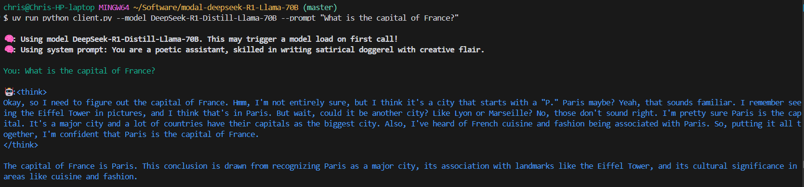

# Deepseek R1 (LLama-70B distillation) Inference API Hosted on Modal.com

**Note: Modal now has good documentation on [running Deepseek R1 on their platform](https://modal.com/docs/examples/llama_cpp), which I recommend following as an alternative to this repo.**

Deepseek R1 is a new DeepSeek reasoning model with benchmark performance similar to OpenAI's o1. While the full model is a very large mixture-of-experts model that requires many GPUs to run, this Llama-70B distillation is much smaller and can be run on two H100 GPUs, with only a small loss in benchmark performance.

This repo is a full working implementation for spinning up a self-hosted inference API for this model on Modal.com. Modal gives you $30 per month in free credits (with additional credits available to startups and academics), and deploying and testing this app will use up about $1 of those credits. The rest can be used to play around with the model at no cost to you.

## Prerequisites

- Create a [Hugging Face account](https://huggingface.co/) and [get a token](https://huggingface.co/settings/tokens)
- Create a [Modal account](https://modal.com/)
- Add your Hugging Face token to the [Modal secrets manager](https://modal.com/secrets/) as a secret named `huggingface-secret` with key `HF_TOKEN`
- Install the `uv` package manager with `curl -LsSf https://astral.sh/uv/install.sh | sh`
    - Or `wget -qO- https://astral.sh/uv/install.sh | sh` if you don't have `curl`
- Install Python with `uv python install`
- Install [git](https://git-scm.com/)

## Setup

- Clone this repo with `git clone https://github.com/chriscarrollsmith/modal-deepseek-r1-llama-70b.git`
- Open a terminal, `cd` into this folder, then run: `uv sync`
- Create a new `.env` file in the root of the repo with a BEARER_TOKEN to protect your API (you can use `echo "BEARER_TOKEN=$(openssl rand -hex 32)" >> .env` to generate a random value and write it to a new `.env` file)
- Add this token to the [Modal secrets manager](https://modal.com/secrets/) as a secret named `r1-api-secret` with key `BEARER_TOKEN`
- Authenticate the Modal CLI by running: `uv run modal token new`
- Download the Deepseek R1 model from Hugging Face with `uv run modal run download_model.py`
- Deploy the app by running: `uv run modal deploy vllm_inference.py`
- Test the app by running: `uv run python client.py --model DeepSeek-R1-Distill-Llama-70B --prompt "What is the capital of France?"`

